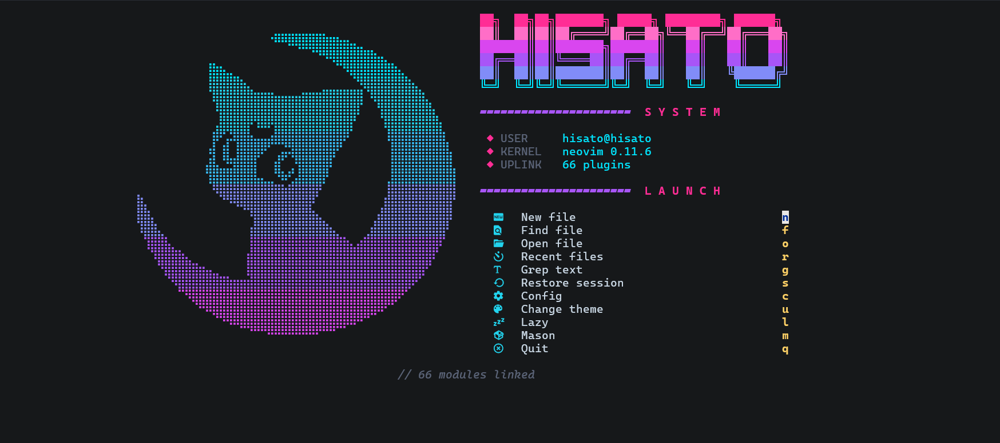
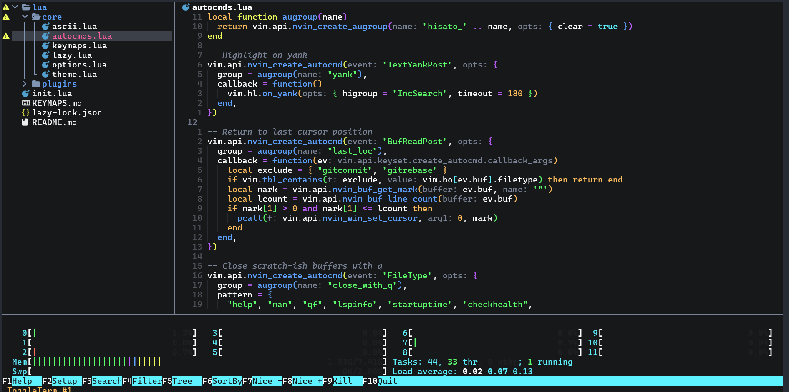

# hisato's Neovim

A hand-rolled Neovim config built on [lazy.nvim](https://github.com/folke/lazy.nvim),
cyberpunk-flavoured. No framework (NvChad/LazyVim) — every file is yours, edit freely.

- **Setting it up elsewhere:** [Installation](#installation)
- **Leader key:** `Space`
- **Full keymap reference:** [KEYMAPS.md](KEYMAPS.md)
- **Forgot a key?** Hold `Space` for 0.4s and which-key shows every branch. Or hit
  `Space f k` to search keymaps with Telescope.

---

## Screenshots

The dashboard on startup:



Editing, with the file tree, LSP inlay hints and a terminal split:



---

## Installation

Setting this up on a fresh machine.

### Requirements

```bash
sudo apt install build-essential unzip ripgrep fd-find git curl nodejs imagemagick
```

See [System dependencies](#system-dependencies) below for what each package is for.
You also want a **Nerd Font** in your terminal (JetBrainsMono Nerd Font is what this
config assumes) — without one, every icon renders as a box.

For the Claude panel (`Space a c`) you also need the Claude Code CLI on `PATH`:

```bash
curl -fsSL https://claude.ai/install.sh | bash
claude --version
```

**Neovim 0.11 or newer is required**, because the LSP setup uses `vim.lsp.config()`
and mason-lspconfig v2's `automatic_enable`, both of which are 0.11 APIs. Ubuntu's
apt version is usually too old, so install a current build:

```bash
curl -LO https://github.com/neovim/neovim/releases/latest/download/nvim-linux-x86_64.tar.gz
sudo tar -C /opt -xzf nvim-linux-x86_64.tar.gz
sudo ln -sf /opt/nvim-linux-x86_64/bin/nvim /usr/local/bin/nvim
nvim --version    # must report 0.11 or newer
```

### Clone

The config directory has to be empty, so move anything already there out of the way:

```bash
mv ~/.config/nvim ~/.config/nvim.bak 2>/dev/null
git clone git@github.com:lenhattri/nvim-wsl ~/.config/nvim
```

No SSH key on that machine? Use HTTPS instead:

```bash
git clone https://github.com/lenhattri/nvim-wsl ~/.config/nvim
```

### First launch

```bash
nvim
```

Everything happens on its own, in this order:

1. lazy.nvim clones itself into `~/.local/share/nvim/lazy/`
2. every plugin is installed at the exact revision pinned in `lazy-lock.json`
3. treesitter compiles its parsers — the slow part, and what needs `build-essential`
4. Mason downloads the LSP servers and the formatters

Expect a minute or two of scrolling output, and possibly a few transient errors while
plugins are still being fetched. Quit once it goes quiet and start `nvim` again: the
second launch should be fast and drop you straight on the dashboard.

### Verify

```vim
:Lazy          " everything installed, nothing marked missing
:Mason         " servers and formatters present
:checkhealth   " the broad check
```

Then open an actual source file and run `:LspInfo` — a server should be attached.

### What the repo does not carry

Machine-local state lives under `~/.local/share/nvim/` and is intentionally not
tracked: installed plugins, Mason's binaries, treesitter parsers, sessions, and the
remembered colorscheme (`~/.local/share/nvim/colorscheme`). A fresh clone therefore
starts on the default theme, `cyberdream`, no matter what you last picked elsewhere.

### Starting over

To wipe every bit of local state and rebuild from the lockfile:

```bash
rm -rf ~/.local/share/nvim ~/.local/state/nvim ~/.cache/nvim
nvim
```

To only move plugins back to their locked revisions, without deleting anything:
`:Lazy restore`.

### On a machine that isn't WSL

Nothing to change. The `clip.exe` / `powershell.exe` clipboard in
`lua/core/options.lua` sits behind a `vim.fn.has("wsl")` check, so anywhere else
Neovim just uses the system clipboard. On a bare Linux box, install `xclip` (X11) or
`wl-clipboard` (Wayland) if `"+y` does nothing.

---

## Structure

```
~/.config/nvim/
├── init.lua                  loads core/ then lazy.nvim
├── images/                   screenshots used by this README
├── lua/core/
│   ├── options.lua           vim options, diagnostics, WSL clipboard
│   ├── keymaps.lua           plugin-independent keymaps
│   ├── autocmds.lua          autocmds (highlight yank, trim whitespace, …)
│   ├── lazy.lua              bootstrap + lazy.nvim config
│   ├── theme.lua             loads/remembers the colorscheme
│   └── ascii.lua             ASCII art for the dashboard (generated file)
└── lua/plugins/
    ├── theme.lua             12 colorschemes
    ├── ui.lua                lualine, bufferline, noice, indent, cursor…
    ├── dashboard.lua         cyberpunk greeting screen
    ├── editor.lua            telescope, nvim-tree, gitsigns, which-key…
    ├── lsp.lua               mason, lspconfig, navic, conform
    ├── cmp.lua               nvim-cmp + LuaSnip
    ├── ai.lua                Claude Code panel + diff review
    ├── image.lua             image rendering in the terminal
    └── treesitter.lua        treesitter + textobjects + context
```

Every file in `lua/plugins/` returns a lazy.nvim spec table. Drop a new file into
that directory and it gets loaded automatically — no need to register it anywhere.

---

## Day-to-day work

### Opening files

| What you want | How |
|---|---|
| Open a file by name | `Space Space` (or `Space f f`) |
| Search by content | `Space f g` |
| Search the word under the cursor project-wide | `Space f w` |
| Recently opened files | `Space f r` |
| File tree | `Space e` |
| Search inside the current file | `Space f /` |

Inside Telescope: `Ctrl-j` / `Ctrl-k` to move, `Enter` to open, `Esc` to quit,
`Ctrl-q` to push every result into the quickfix list.

### Editing code with LSP

Servers install themselves through Mason and start automatically when you open a
matching filetype.

| What you want | How |
|---|---|
| Go to definition | `g d` |
| See every usage | `g r` |
| Read the docs | `K` |
| Rename a variable/function | `Space l r` |
| Auto-fix a problem | `Space l a` |
| See the error on the current line | `Space l d` |
| Jump to the next error | `] d` |
| Project-wide error list | `Space x x` |

### Git

| What you want | How |
|---|---|
| Next/previous hunk | `] h` / `[ h` |
| Preview a hunk | `Space g p` |
| Stage a hunk | `Space g h` |
| Reset a hunk | `Space g r` |
| Who touched this line | `Space g B` |
| Diff the whole file | `Space g d` |
| Commit history | `Space g c` |

Inline blame for the current line fades in at the end of the line after 0.5s.
Turn it off with `Space g t`.

### Formatting code

Saving a file formats it (conform.nvim). To disable temporarily:

```vim
:FormatDisable     " disable globally
:FormatDisable!    " disable for the current buffer only
:FormatEnable      " turn it back on
```

Format manually: `Space c f`.

### Claude Code

`Space a c` opens Claude Code in a split on the right. It isn't just a terminal:
the plugin ([claudecode.nvim](https://github.com/coder/claudecode.nvim)) runs the
same IDE protocol the VS Code extension uses, over a local WebSocket, so nvim and
Claude share state.

What that buys you over running `claude` in a terminal:

- Claude always knows which file you're in and what's selected.
- `Space a s` on a visual selection sends those exact lines.
- `Space a b` drops the whole current file into the context, `Space a s` in the
  file tree does the same for whatever is under the cursor.
- **Edits arrive as a diff, not as a write.** A proposed change opens in a new tab
  as a vertical diff — your version on the left, Claude's on the right. `Space a a`
  accepts it, `Space a d` rejects it. Nothing lands on disk until you say so.

`Space a r` lists past sessions in this directory, `Space a C` picks the last one
back up, `Space a m` switches model. Full list in [KEYMAPS.md](KEYMAPS.md#ai-claude-code).

The server only starts once you first open the panel, so it costs nothing at
startup. `Space a i` shows whether Claude is connected.

---

## Images

Opening a `.png`, `.jpg`, `.gif`, `.webp` or `.avif` shows the picture instead of a
screenful of binary, and image links in markdown render inline — the screenshots at
the top of this file are visible while editing it. `Space u i` turns rendering off
and on.

It needs **ImageMagick** (`sudo apt install imagemagick`) to decode and resize. The
plugin skips loading entirely when it's missing, so run `:Lazy sync` after
installing it.

### How it draws, and what that costs

`lua/plugins/image.lua` sniffs `TERM`, `TERM_PROGRAM` and the terminal's own env
vars and picks a backend:

| Terminal | Backend | Notes |
|---|---|---|
| Kitty, Ghostty | kitty graphics protocol | Images live in their own layer. Nothing can draw over them |
| Windows Terminal ≥ 1.22.10352 | sixel | What WSL gets by default. Works, with the caveat below |
| WezTerm | sixel | Speaks the kitty protocol too, but slowly and incompletely |

The caveat: **sixel pixels live in the text grid.** Anything nvim draws over an
image erases it — a float, the cursor line, a cursor trail — and image.nvim only
repaints when the image's geometry changes, so a redraw leaves a permanent hole.
The config covers that with a debounced repaint on scroll, resize, window change
and cmdline exit, and by switching `cursorline` off in image buffers. The
smear-cursor trail, which repaints cells across the screen, is disabled outright
in `lua/plugins/ui.lua`. Each repaint forces a full redraw and re-sends the frame, which reads as
a blink, so the event list is kept deliberately short.

If the blinking bothers you, the way out is a terminal that speaks the kitty
protocol. WSLg gives WSL a real Wayland display, so one can run as a native app:

```bash
sudo apt install ghostty
ghostty &          # opens a window on the Windows desktop
```

It needs a **Nerd Font installed in Linux**, not just in Windows — drop the `.ttf`
files in `~/.local/share/fonts/` and run `fc-cache -f`. `~/.config/ghostty/config`
is themed to match cyberdream. If no window opens, try `GDK_BACKEND=x11 ghostty`.

### One option that must stay off

`window_overlap_clear_enabled` sounds like it only matters for floats. It makes the
renderer bail out whenever *any* other window masks the one holding the image — and
nvim-tree counts. Turn it on and images silently never draw while the file tree is
open, which looks exactly like a broken terminal. It is off by default upstream;
leave it off.

Markdown only renders the image nearest the cursor, which keeps a document full of
screenshots from re-encoding all of them every time you scroll.

---

## Switching themes

`Space u c` opens a list of 62 themes with **a live preview as you move the cursor**.
Once you pick one, the choice is written to `~/.local/share/nvim/colorscheme` and
applied automatically on the next startup.

The default is `cyberdream`. Change it in `lua/core/theme.lua`:

```lua
local DEFAULT = "cyberdream"
```

The dashboard always keeps its own neon palette and does not follow the theme.

---

## Customising

### Adding a plugin

Create a new file in `lua/plugins/`, e.g. `lua/plugins/extra.lua`:

```lua
return {
  {
    "author-name/plugin-name",
    event = "VeryLazy",        -- load lazily for a fast startup
    opts = { ... },            -- lazy.nvim calls require("name").setup(opts) for you
  },
}
```

Save the file, then `Space L` → `I` to install. Or restart nvim and lazy picks it up.

### Adding an LSP server

Open `lua/plugins/lsp.lua` and add the server name to `ensure_installed`:

```lua
ensure_installed = {
  "lua_ls", "ts_ls", "html", "cssls", "jsonls", "bashls", "pyright",
  "gopls",          -- example: add Go
},
```

Mason downloads it and `automatic_enable` starts it. For custom settings, add:

```lua
vim.lsp.config("gopls", {
  settings = { gopls = { ... } },
})
```

> **Note:** `stylua` is in the `exclude` list of `automatic_enable`.
> nvim-lspconfig ships an `lsp/stylua.lua` file, so mason-lspconfig mistakes
> stylua for a language server and starts it — it exits immediately with code 2.
> stylua is invoked properly by conform.nvim. Other formatters can hit the same
> problem; if you see "Client X quit with exit code", add X to `exclude`.

### Adding a formatter

Two places, both in `lua/plugins/lsp.lua`:

```lua
-- 1. let Mason download it
{ "WhoIsSethDaniel/mason-tool-installer.nvim",
  opts = { ensure_installed = { "stylua", "prettierd", "shfmt", "ruff", "gofumpt" } } }

-- 2. map it to a filetype
formatters_by_ft = {
  go = { "gofumpt" },
}
```

### Adding a treesitter language

`lua/plugins/treesitter.lua` → `ensure_installed`. You usually don't need to:
`auto_install` is on, so opening an unfamiliar file fetches the parser by itself.

### Changing the dashboard ASCII art

The art lives in `lua/core/ascii.lua` (`portrait` for wide screens, `uwu` for narrow
ones). To swap it, paste your art there and adjust `ART_W` in
`lua/plugins/dashboard.lua` to match the new art's **width in cells**.

Prefer **braille** art (`⣿⡿⠿`) over block art (`██░░▒▒`): braille packs 8 dots into
a single cell so it looks far smoother, while blocks only have 4 brightness levels
and end up looking pixelated.

---

## How fast does it start

The dashboard shows the real numbers on its last line. To see which plugin is slow:

```vim
:Lazy profile
```

Every plugin is lazy-loaded except the colorscheme group (it has to load early so
`Space u c` can preview) and lualine/bufferline/noice (loaded on `VeryLazy`, i.e.
after the screen has been drawn).

---

## Running under WSL

Most of this config doesn't care what it runs on. Three things do.

**Clipboard.** `clipboard = "unnamedplus"` means every yank and every paste goes
through the provider, so the provider's cost is paid on every single one. The usual
WSL recipe — `clip.exe` to copy, `powershell.exe -c Get-Clipboard` to paste —
measures at **~350ms per paste** here, because that is what spawning powershell
costs. WSLg bridges the Windows clipboard into its own X server, so `xclip` reads
and writes the real Windows clipboard in **under 10ms**, verified in both
directions. `lua/core/options.lua` uses xclip when `DISPLAY` and the binary are
both there and falls back to the powershell recipe otherwise, so it still works on
Windows 10 or with WSLg off.

**Keep projects on the Linux side.** Writing 300 small files takes 0.04s under `~`
and **0.99s under `/mnt/c`**; `grep -r` over them, 0.01s against 0.18s. Telescope,
ripgrep, git and every LSP pay that tax on each call, so a repo under
`/mnt/c/Users/...` will feel broken in a way no config can fix. Clone into `~`.

**Undercurl degrades silently.** `xterm-256color` has no `Smulx` capability, so nvim
never emits the curly-underline sequence and the `undercurl` styling for errors
lands as a plain straight underline. Nothing breaks, it just isn't what the theme
asked for. Check whether your terminal would do it at all with:

```bash
printf '\e[4:3m\e[58:2::255:0:0mcurly?\e[0m\n'
```

If that shows a red wavy underline, a custom terminfo entry with `Smulx` would get
it back; if it shows a straight line or nothing, the terminal can't do it anyway.

Images are their own story — see [Images](#images).

---

## Troubleshooting

| Symptom | Cause & fix |
|---|---|
| Icons show up as boxes | The terminal isn't using a Nerd Font. Install JetBrainsMono Nerd Font, then pick it in Windows Terminal → Settings → profile → Appearance → Font face |
| Treesitter reports a compile error | Missing `gcc`/`make`: `sudo apt install build-essential` |
| Mason can't install a server | Missing `unzip`: `sudo apt install unzip` |
| LSP isn't running | `:LspInfo` to check whether it attached, `:Mason` to check it's installed, `:checkhealth lsp` |
| A plugin broke after an update | `:Lazy restore` to go back to the lockfile, or `:Lazy clean` then `:Lazy sync` |
| Copy/paste doesn't reach Windows | See [Running under WSL](#running-under-wsl); the provider is picked in `lua/core/options.lua` |
| Terminal too small/large | `C-Up` `C-Down` `C-Left` `C-Right` right inside the terminal. Change the default size via `size`/`float_opts` in `lua/plugins/editor.lua` |
| Claude panel says the CLI is missing | The `claude` binary isn't on `PATH`. Install it (see [Requirements](#requirements)), or point `terminal_cmd` in `lua/plugins/ai.lua` at it |
| Images stay as a wall of text | The terminal can't draw them, or ImageMagick is missing — see [Images](#images) |
| Images blank while the file tree is open | `window_overlap_clear_enabled` got turned on somewhere — see [Images](#images) |
| Want an overall check | `:checkhealth` |

Handy diagnostic commands:

```vim
:Lazy          " plugin manager (I install, U update, X remove, P profile)
:Mason         " LSP/formatter manager (i install, X uninstall)
:LspInfo       " which servers are attached to this buffer
:ConformInfo   " which formatters apply to this buffer
:checkhealth   " check everything
```

---

## System dependencies

Already installed on this machine. If you're setting it up elsewhere:

```bash
sudo apt install build-essential unzip ripgrep fd-find git curl
# nodejs for the JS-based LSPs (ts_ls, html, cssls, jsonls, bashls)
# imagemagick only if you want images to render
```

| Package | What it's for |
|---|---|
| `build-essential` | compiling treesitter parsers — **required** |
| `unzip` | Mason unpacking LSP archives |
| `ripgrep` | `Space f g` content search |
| `fd-find` | faster file search (the binary is called `fdfind` on Ubuntu) |
| `nodejs` | running the JavaScript-based LSPs |
| `imagemagick` | decoding images for [Images](#images) — optional |
